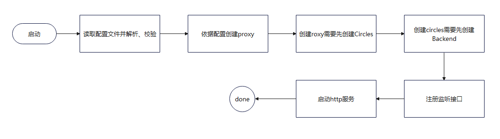

# influx-proxy流程解析

## 整体理解
下图是整个influx-proxy的程序入口，可以看到，整个influx-proxy程序就是启动了一个web服务器，服务器接受外部请求然后处理，最后返回响应

## 流程梳理

### 服务启动
* 在下图中标示1的框图即是整个influx-proxy流程启动的开始

* 整体服务启动流程图如下：

* 在创建Backend的过程中，执行了如下动作：

### ping接口处理流程
* `/ping`接口的流程相对比较简单，只是为了验证influx-proxy是否还存活（至于influxDB实例的状态，本接口不关心）
* 接口流程时序如下:

### query接口处理流程
> 并不是只有查询才走query，一些drop操作、alter操作也会走query接口
> 可以是post方式，也可以get方式
* 接口流程图如下:

### write接口处理流程
> 必须是post方式
* 接口流程图如下：

在flush的过程中，会对influxdb实例进行写入，如果写入失败了，则会将本次缓存中的数据写入本地磁盘文件，然后会有协程周期性把数据从磁盘文件写入influxdb